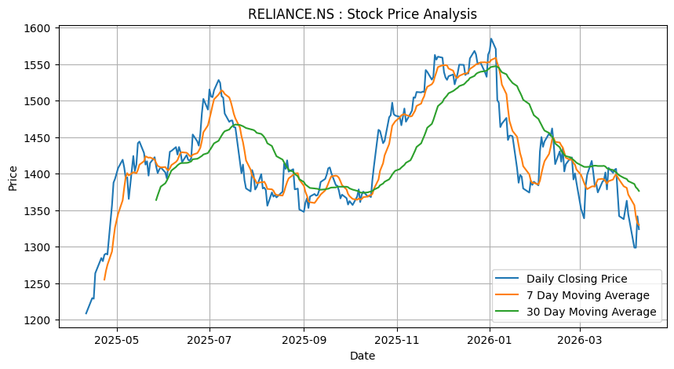

<div align="center">



# 📈 Stock Price Analyzer

### Yahoo Finance–Powered Market Intelligence Dashboard

[](https://id-preview--4552a1e1-334b-4936-9cd4-bb87a8f6003a.lovable.app)
[](https://react.dev)
[](https://finance.yahoo.com)

</div>

---

## 🚀 Overview

**Stock Price Analyzer** is a market intelligence dashboard that lets you search any stock symbol and instantly explore its historical performance through interactive charts, moving averages, and OHLC (Open-High-Low-Close) data.

Whether you're tracking **AAPL**, **TSLA**, **INFY.NS**, or **RELIANCE.NS**, the tool gives you a fast, visual read on market trends over any custom date range — for both global and Indian markets.

---

## ✨ Features

| Feature | Description |
|---|---|
| 🔍 Symbol Search | Look up any stock — global tickers or NSE stocks via `.NS` suffix |
| 📊 OHLC Charts | Interactive Open-High-Low-Close visualization |
| 📉 Moving Averages | 7-day & 30-day trend indicators |
| 🗓️ Custom Date Range | Analyze any historical period |
| 🌏 Global + Indian Markets | One dashboard, both markets |
| ⚡ Live Data | Real-time & historical prices via Yahoo Finance |

---

## 🛠️ Tech Stack

`React` · `TypeScript` · `Yahoo Finance API` · `Bun` · Built with [Lovable](https://lovable.dev)

---

## 🖥️ Live Demo

🔗 **[Try the live app →](https://id-preview--4552a1e1-334b-4936-9cd4-bb87a8f6003a.lovable.app)**

---

## 📓 Notebook Analysis

This repo also includes [`stock_price_analyser.ipynb`](./stock_price_analyser.ipynb) — a companion Jupyter notebook covering exploratory stock price analysis using Python (`pandas`, `matplotlib`, `yfinance`).

The notebook computes daily closing prices alongside **7-day** and **30-day moving averages** to visualize short-term vs long-term trend behavior, as shown in the chart above.

---

## ⚙️ Getting Started

```bash
# Run the dashboard
git clone https://github.com/LAXMI15PRIYA/market-insights-dashboard.git
cd market-insights-dashboard
bun install
bun run dev
```

```bash
# Run the notebook
pip install pandas matplotlib yfinance
jupyter notebook stock_price_analyser.ipynb
```

---

## 📌 Roadmap

- [ ] RSI & MACD indicators
- [ ] Portfolio comparison view
- [ ] CSV export
- [ ] Candlestick chart view

---

## 👩‍💻 Author

**Lakshmi** — Aspiring AI Engineer / Data Analyst
M.Tech AI & Data Science, SRMIST
[GitHub](https://github.com/LAXMI15PRIYA)

---

<div align="center">

⭐ *If you found this useful, consider giving it a star!*

</div>
